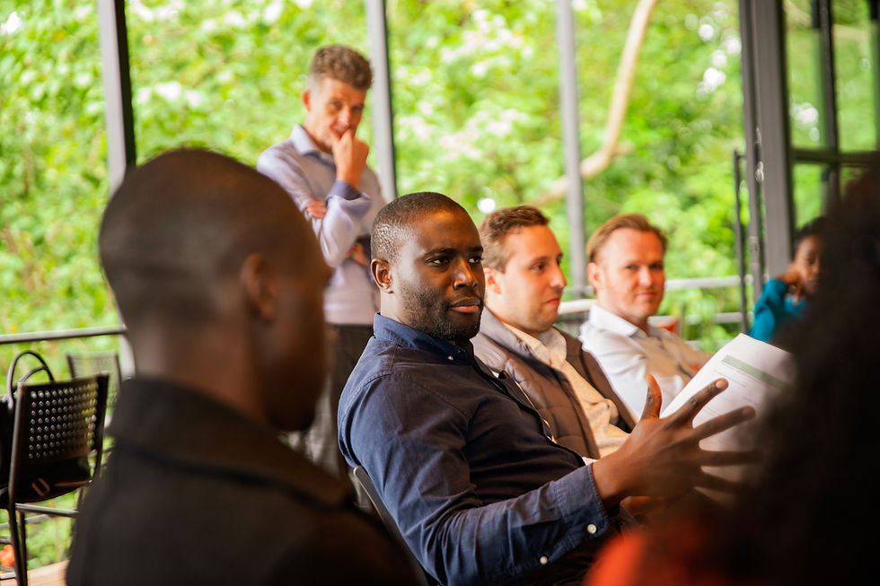

# Language Coaching & Consulting — Landing Page

A single-page landing that promotes **language coaching** and **consulting**, with CTAs that send visitors to Paystack to pay and book.

## Quick start

Open `index.html` in a browser, or run a local server:

```bash
npx serve .
```

Then open the URL shown (e.g. `http://localhost:3000`).

## 1. Set your Paystack payment link

All “Book”, “Pay”, and “Get Started” buttons use this URL:

```
https://paystack.com/pay/your-payment-slug
```

**Replace `your-payment-slug`** with your real Paystack payment page slug:

1. In [Paystack Dashboard](https://dashboard.paystack.com) go to **Payment Pages** (or create a payment link).
2. Copy the slug from your payment link (e.g. `language-coaching` → `https://paystack.com/pay/language-coaching`).
3. In `index.html`, replace every instance of `your-payment-slug` with your slug.

You can use one Paystack link for both services, or create two (e.g. coaching vs consulting) and change the `href` of the relevant buttons.

## 2. Adding images

There are **3 image areas** (placeholders):

| Section            | Location in HTML                         | Suggested size |
|--------------------|------------------------------------------|----------------|
| Language coaching  | `.section-coaching .image-placeholder`   | 800×600px      |
| Consulting         | `.section-consulting .image-placeholder` | 800×600px      |
| About / trust      | `.section-about .image-placeholder-wide` | 1200×600px     |

To use your own image:

1. Put the image in the project folder (e.g. `images/coaching.jpg`).
2. Replace the placeholder `div` with an `img`:

**Before (placeholder):**
```html
<div class="image-placeholder" data-label="...">
  <span>Image placeholder</span>
  <small>Recommended: 800×600px</small>
</div>
```

**After (real image):**
```html

```

3. In `styles.css`, the existing `.section-image-wrap` will contain the image; add if needed:

```css
.section-image-wrap img {
  width: 100%;
  height: auto;
  border-radius: var(--radius-lg);
  object-fit: cover;
}
```

## 3. Customize branding

- **Site name:** Search for `VerbaStrategy` in `index.html` and replace with your name.
- **Colors:** In `styles.css`, edit the `:root` variables (e.g. `--color-accent`, `--color-bg`).
- **Copy:** Edit headings and paragraphs in `index.html` to match your offer and tone.

## Files

- `index.html` — Page structure and content
- `styles.css` — Layout and styling
- `script.js` — Mobile menu and smooth scroll

No build step required; use as static files or host on any web server.
